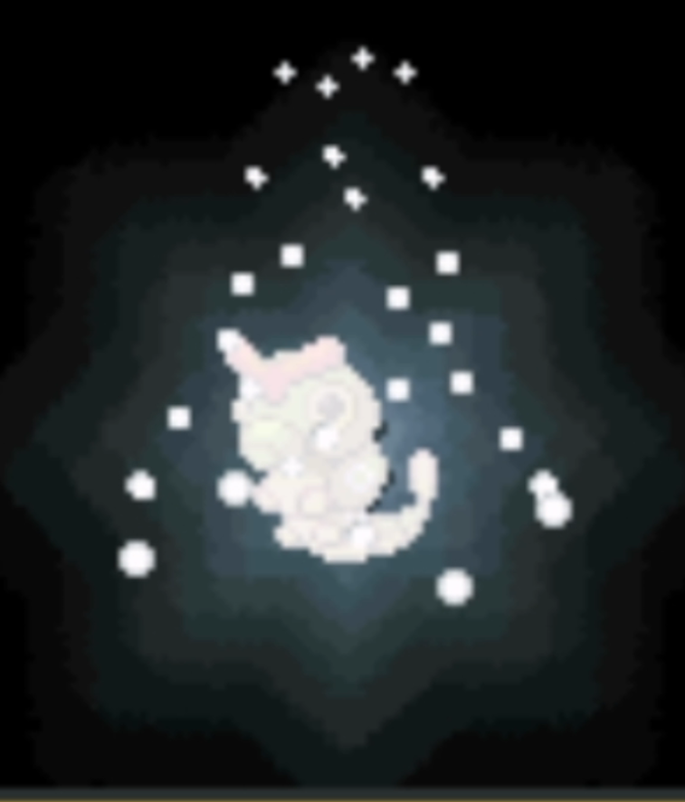
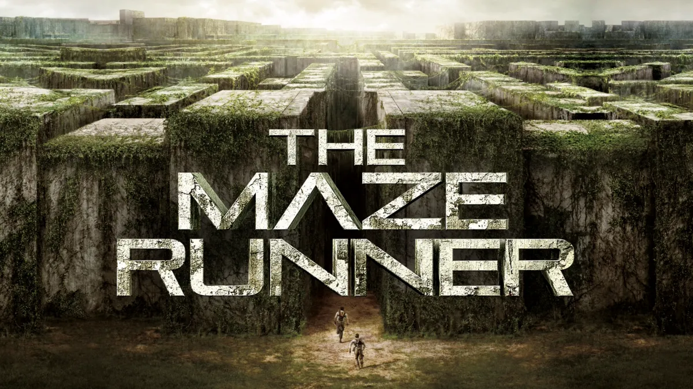

# Creative coding major project

## Interactive Description
This code is based on the group work, but adding extra functions on it. There are three main pages over here. To switch among three page, you can simply press key '2', '3', and 'c'. 

On the page '2', you can increase or decrease the width of the rectangle lines by pressing the up or down arrow keys. You can also change the color style by pressing the left or right arrow keys.

On page '3', mouse actions are available. Keep pressing the left key of mouse to rotate and pressing right key to transform it. Zoom in and out are also available if you scroll your roller. You can also press the up or down arrow keys to increase or decrease the width of the element.

On page 'space', the artwork on page '3' will decompose into many cubes.

## Individual Approach
Based on the group project, I developed 3D dynamic effects. 

If you press key "2", it will switch to a 2D plane state where squares and small squares simulate the fast flow and jitter of vehicles. In this state, pressing the "up" or "down" arrow keys will increase or decrease the width of the shapes, while pressing the "left" and "right" arrow keys will change their color. 

If you press key "3", you will get a 3D shape. By pressing the left mouse button, you can freely rotate the shape to view its details; by holding the right mouse button, you can pan the shape; and by scrolling the mouse wheel, you can zoom in or out. 

If the 'space' is pressed, the shapes on page '3' will decompose. 

Pressing key "C" will return you to the initial page.

## Inspiration
My inspiration comes from the evolution of Pokemon and the movie "Maze Runner". I feel that the fragmented sense of Pokemon's evolution is exactly what I expect from this artwork. I think that by using a spiral-upward style and feeling, I can enhance the three-dimensional aspect of this artwork. Additionally, because this artwork is based on a basic square or pixel style, it also corresponds well to the feeling of the digital world depicted in the Digimon series. The theme I want to convey is the sensation of traversing spatial dimensions, from a 2D plane to a three-dimensional space.

Evolution of Caterpie

Poster of The Maze Runner

## Technical Explanation
The spiral upward movement on the initial page is inspired by the ["Sine Cosine in 3D"](https://p5js.org/examples/3d-sine-cosine-in-3d.html) page in ['P5.js'](https://p5js.org/). The background is adapted based on my team member's work. The fading effect is achieved by overlaying a layer with gradually decreasing opacity. As the frame count increases, the opacity decreases, eventually covering the entire base to create a sense of gradual disappearance. 

On the page ‘2’, the method to increase the width of the rectangles is because I set the initial ratio to 0.02. If you press the left arrow key, it decreases by 0.01, and if you press the right arrow key, it increases by 0.01. The range from the minimum to the maximum value is from 0.001 to 0.01. The method to change the color is that I created an array containing eight colors and set the initial color value to zero. This value increases or decreases as the left or right arrow key is pressed, but it can only be between zero and three.

The 3D effect on the page '3' is based on an equation called ["box"](https://p5js.org/reference/#/p5/box) in P5.js.

When the 'space' is pressed, the decomposed state will change from false to true, and then 100 small cubes will appear in the center of the screen.